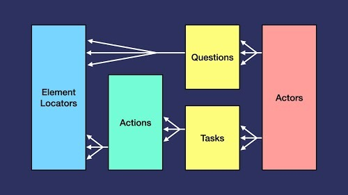
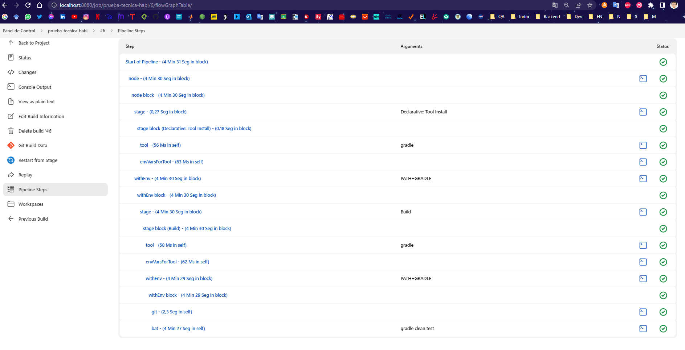
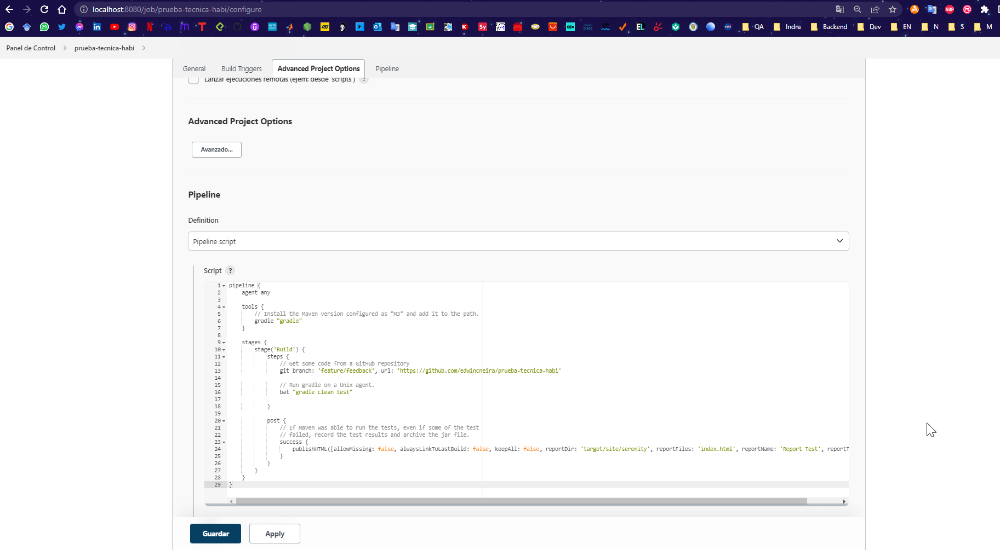
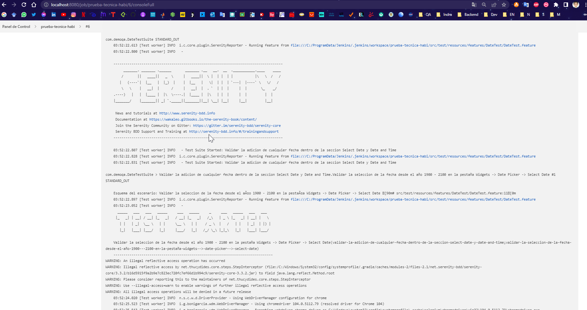
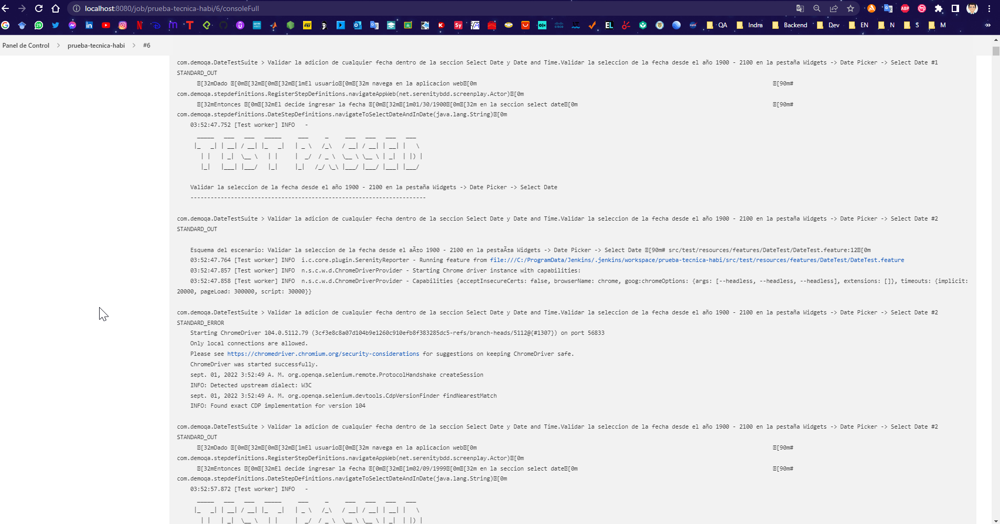
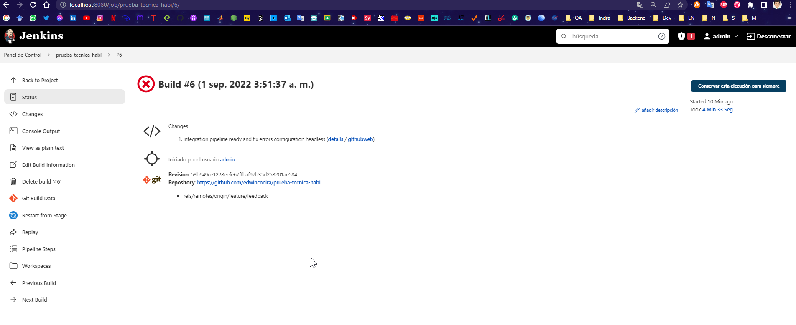

# Automation for demoqa.com (18 Tests)

### Tools:

## Languages

##### Java

- Main programming language for this project, strong typing, object oriented.

##### Gherkin

- Gherkin is a Domain Specific Language (DSL), which are languages specifically designed to solve a very specific problem

----

## Frameworks

##### Cucumber > serenity-cucumber

- [Cucumber](https://cucumber.io/docs/cucumber/): Cucumber is a software tool that supports behavior-driven development
- [serenity-cucumber:](https://javadoc.io/doc/net.serenity-bdd/serenity-cucumber/latest/index.html) Write automated acceptance with Serenity and Cucumber

##### SerenityBDD with Java

- [serenity-core:](https://javadoc.io/doc/net.serenity-bdd/serenity-core/latest/index.html) Write automated acceptance tests of higher quality and more efficiently
- [serenity-screenplay:](https://javadoc.io/doc/net.serenity-bdd/serenity-screenplay/latest/index.html) Integration Screenplay pattern and Serenity, actor, questions, interactions, etc, ect
- [serenity-ensure:](https://mvnrepository.com/artifact/net.serenity-bdd/serenity-ensure/3.3.2) Assertions in Serenity Screenplay
- [serenity-screenplay-webdriver:](https://javadoc.io/doc/net.serenity-bdd/serenity-screenplay-webdriver/latest/index.html) Integration Serenity screenplay and webdriver
----

#### Selenium Web Driver

----

## Main Libraries

#### java.sql

----

## Design

* ScreenPlay Layout Pattern

----

## CI/CD Tool for Pipeline

* Jenkins: Jenkins is an open source automation server written in Java.
* Pipeline is a suite of plugins which supports implementing and integrating continuous delivery pipelines into Jenkins

----

## Dependency Manager

- Gradle

----

### Data Base Configuration

#### Set the following environment variables on your local machine

| Env                  | Use                    |
|----------------------|------------------------|
| USER_DB_DEMOQA       | User your database     |
| PASSWORD_DB_DEMOQA   | Password your database |
| HOST_DB_DEMOQA       | Host your database     |

----

- Run the main project `src\test\java\com\demoqa\utils\mysql\DbRun.java` the connection is implemented with `java.sql`

----

### Bugs 

- Date and time section does not work correctly. It only selects the month and the day but does not select the year or the hour

----

### Run

#### With Java Version 11 `jdk_11_0_15` 

`$ git clone https://github.com/edwincneira/prueba-tecnica-habi`

`$ git checkout feature/feedback`

`$ gradle clean test `

----

### See the report of Serenity on the folder file `/target/site/serenity/index.html`

----

## Pipeline with Jenkins

- Steps Pipeline success

----

- Configuration Pipeline

----

- Serenity Started 

----

- First Test Passed

----

- Status Pipeline: Tests success but build failure

----
